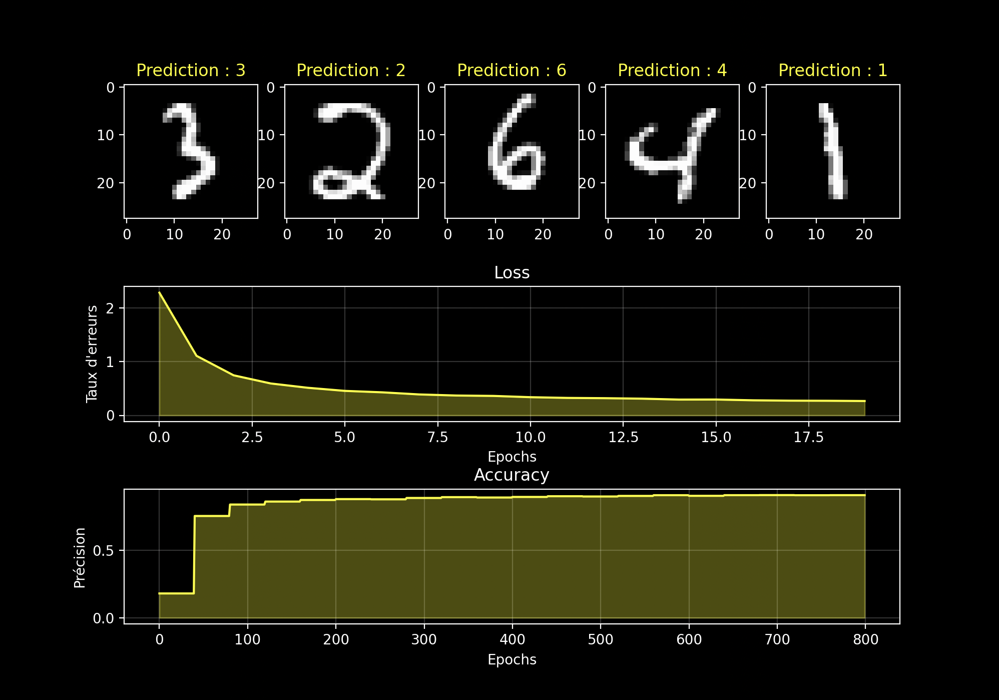

# Neural Network from Scratch 


 
A fully hand-coded neural network built from scratch using only NumPy — no PyTorch, no TensorFlow, no `model.fit()`.
 
## What's inside
 
- **Backpropagation** coded entirely by hand, including all gradient derivations
- **MNIST digit classification** reaching ~94% accuracy on the test set
- **Mini-batch SGD** with dataset shuffling at each epoch
- **Activation functions**: ReLU, Tanh, Softmax
- **Loss functions**: MSE, Cross-Entropy
- **Visualization**: training curves (loss & accuracy) + sample predictions
## Architecture
 
```
Input (784) → Dense (128, ReLU) → Dense (64, ReLU) → Dense (10, Softmax)
```
 
## Results
 
| Metric | Value |
|--------|-------|
| Test Accuracy | ~94% |
| Dataset | MNIST (60,000 train / 10,000 test) |
| Epochs | 30 |
| Batch size | 256 |
| Learning rate | 0.1 |
 
## What I implemented from scratch
 
- Forward pass
- Backpropagation with chain rule (derived by hand)
- Weight initialization
- Mini-batch training loop with shuffle
- Cross-entropy loss + Softmax (simplified gradient)
- Accuracy metric
- Training visualization with Matplotlib
## Requirements
 
```bash
pip install numpy matplotlib tensorflow  # tensorflow used only to load MNIST
```
 
## Usage
 
```python
nl = NeuralNetwork(lr=0.1)
nl.train(X_train, y_train_oh, X_test, y_test_oh, epochs=30, batch_size=256)
nl.plot_visualisation()
```
 
## Motivation
 
This project was built to deeply understand the internals of neural networks before moving to higher-level frameworks. Every gradient was derived on paper before being coded — including the softmax + cross-entropy simplification.

## Visual Results


